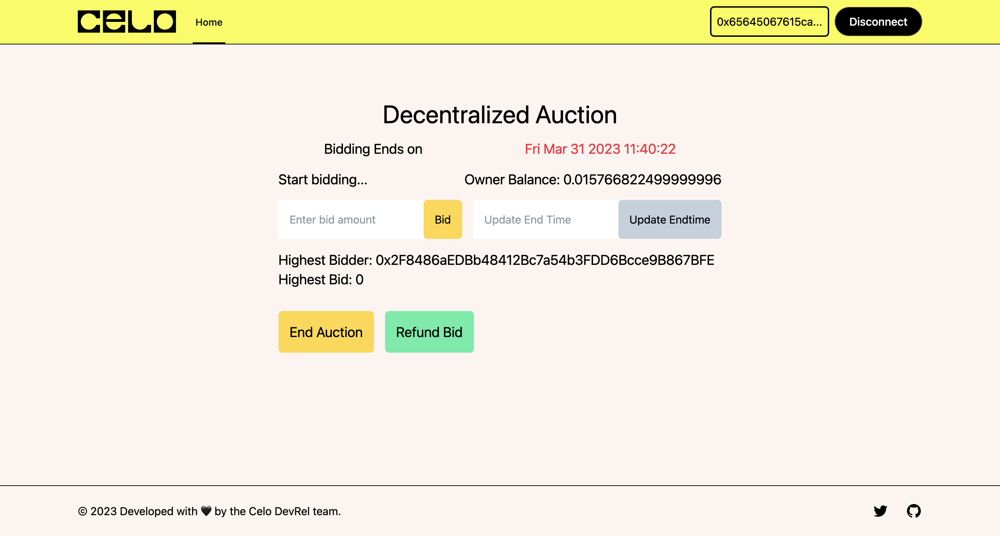

# Decentralized Auction Dapp with Celo Composer
The auction dApp was built using Celo Composer. 

The contract contains for the following
  - Bidding
  - EndAuction
  - Get Enddate
  - Get Highest bidder
  - Refund bid to bidders
  - Send the highest bid to the contract owner
  - Update end time.
## Demo

This screen shows when the auction is still ongoing

This screen shows when the auction has ended

